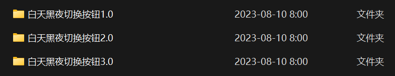
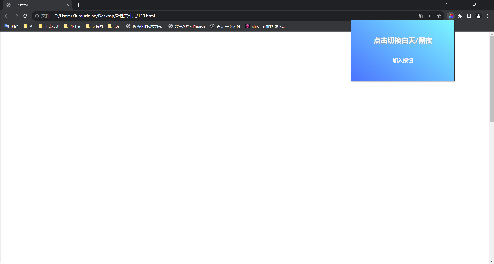
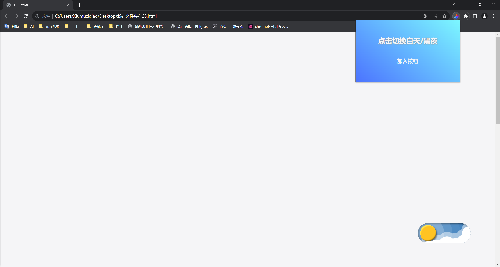
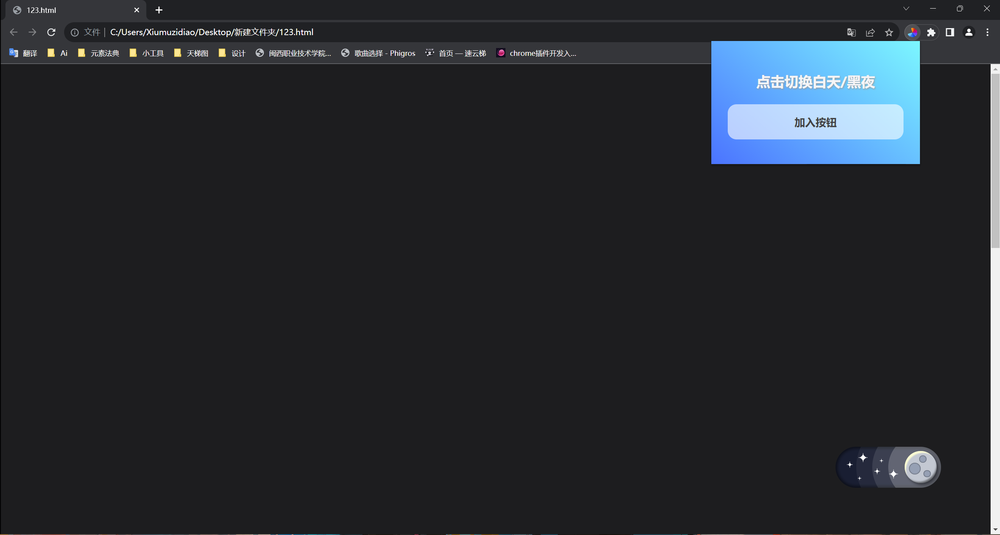
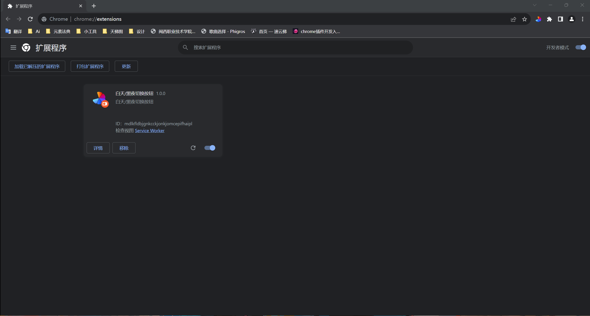
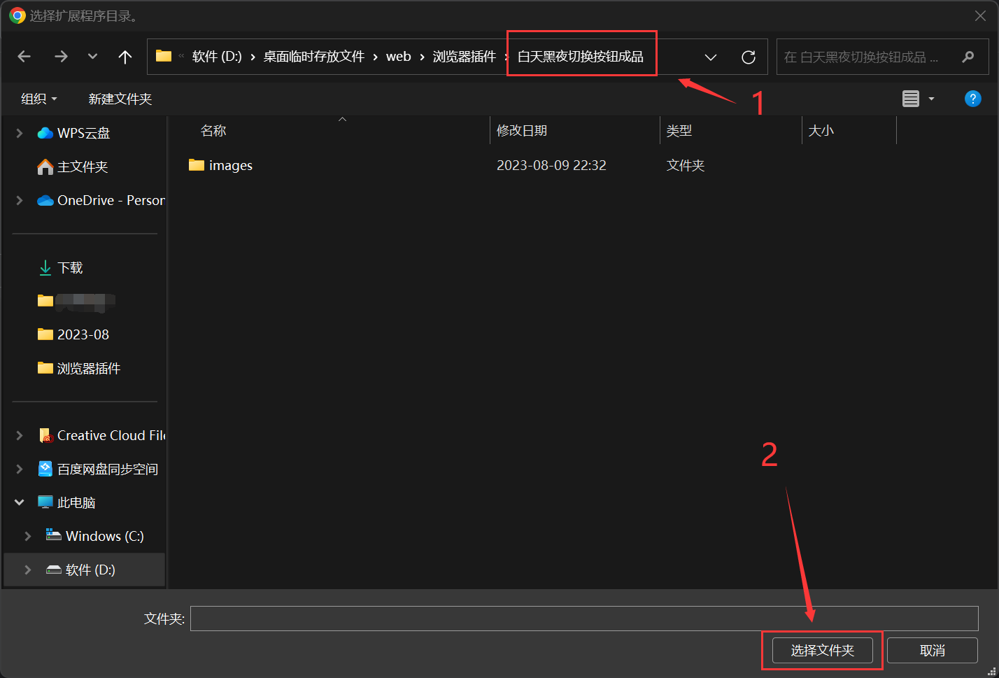

# 白天黑夜切换按钮

#### 白天

#### 黑夜

#### 目前已迭代三版，来自不同开发者，各位可选择自行下载

#### 新增浏览器插件

#### 使用方法

#### 打开Google Chrome浏览器，点击右上角三个点，依次点击“扩展程序”=>"管理扩展程序"，然后打开开发者选项，再点击左上角加载已解压的扩展程序，选择插件所在的文件夹，然后点击“选择文件夹”

#### 最后启动插件即可

